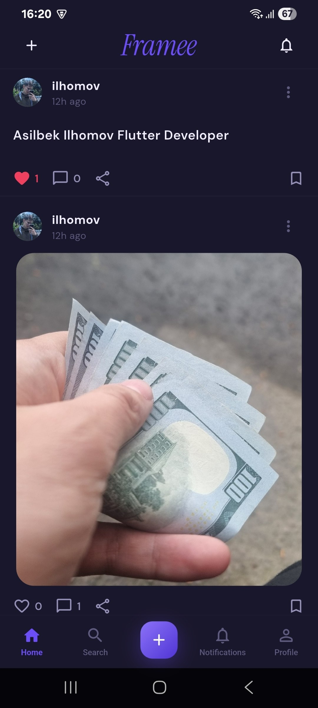
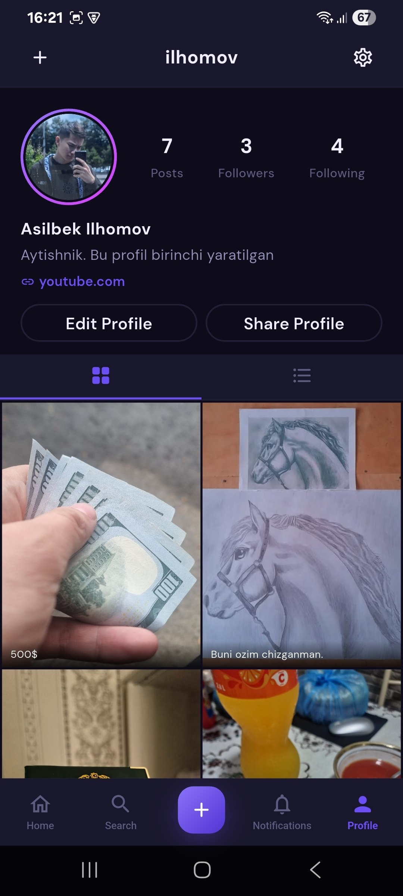
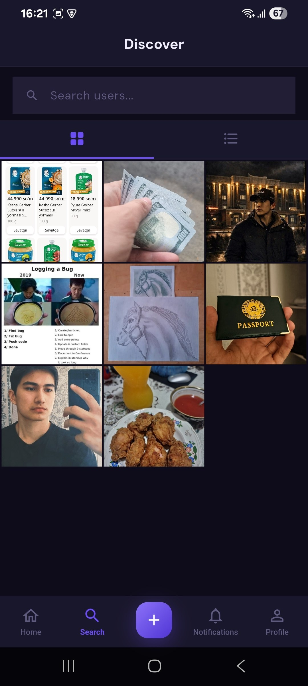
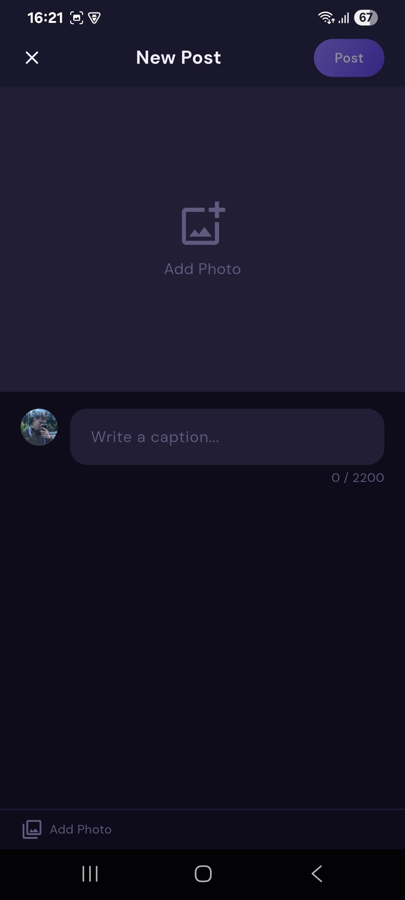
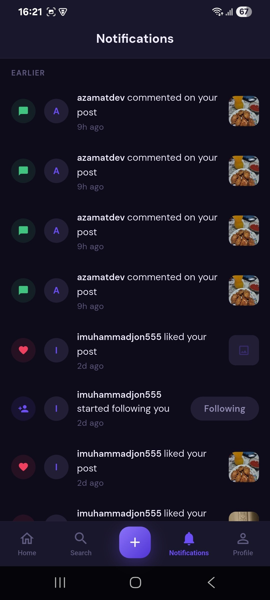
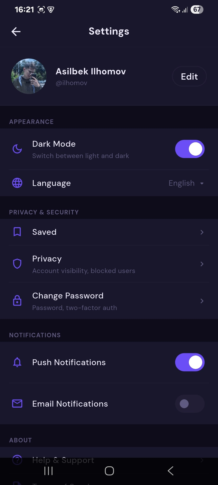
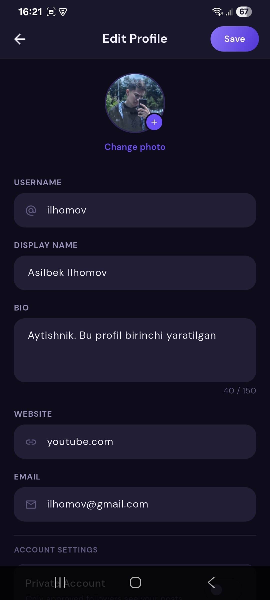

# Framee

A full-featured social media mobile app built with Flutter and Supabase. Users can create posts with images and captions, follow others, explore content, interact via likes and nested comments, and share posts or profiles via deep links.

## Screenshots

| Home | Profile | Search |
|------|---------|--------|
|  |  |  |

| Create Post | Notifications | Settings |
|-------------|---------------|----------|
|  |  |  |

| Edit Profile |
|-------------|
|  |

---

## Features

- **Authentication** — Sign up, login, session persistence with Supabase Auth
- **Feed** — Paginated home feed with like, save, comment, and share actions
- **Create Post** — Instagram-style post creation with image picker and caption
- **Post Detail** — Full post view with nested comment threads, reply system, and optimistic UI
- **Explore** — Photo grid and text post tabs with pull-to-refresh
- **Profile** — User profile with post grid, followers/following counts, edit profile
- **Notifications** — Activity notifications with toggle settings
- **Deep Links** — Android App Links (`framee.app`) for sharing posts and profiles
- **Dark / Light Mode** — Adaptive theming persisted via SharedPreferences

---

## Tech Stack

| Layer | Technology |
|-------|-----------|
| UI | Flutter 3.x / Dart 3.x |
| State Management | Riverpod 2 (`AsyncNotifier`, `FamilyAsyncNotifier`) |
| Navigation | go_router 14 (Navigator 2.0) |
| Backend | Supabase (Auth, PostgreSQL, Storage) |
| Images | cached_network_image + image_picker |
| Push Notifications | Firebase Cloud Messaging |
| Secure Storage | flutter_secure_storage |
| Preferences | shared_preferences |
| Responsive UI | flutter_screenutil (base: 393×852) |
| Sharing | share_plus + Android App Links |

---

## Architecture

Clean Architecture with strict layer separation:

```
lib/
├── core/
│   ├── components/        # Reusable widgets (PostCard, AppAvatar, AppButton, etc.)
│   ├── constants/         # AppColors, AppTextStyles, AppDimens, AppStrings
│   ├── errors/            # Result<T> type, AppFailure sealed class
│   ├── extensions/        # BuildContext, String, DateTime, num extensions
│   ├── providers/         # currentUserProvider, themeProvider
│   ├── router/            # go_router AppRouter + AppRoutes + deep link config
│   ├── theme/             # AppTheme (light + dark)
│   └── utils/             # ShareUtils, AppLogger
│
├── features/
│   ├── auth/              # Login, SignUp screens + AuthNotifier
│   ├── home/              # Feed screen + HomeNotifier (pagination)
│   ├── post/
│   │   ├── data/          # PostRemoteDataSource (Supabase queries)
│   │   ├── domain/        # Post, Comment entities + use cases
│   │   └── presentation/  # CreatePost, PostDetail screens + providers
│   ├── profile/           # Profile, EditProfile, Followers screens
│   ├── search/            # Explore grid (photo + text tabs)
│   ├── notifications/     # Notifications screen + settings toggles
│   └── settings/          # Settings screen (theme, logout)
│
└── main.dart
```

---

## Setup

### 1. Clone and install dependencies
```bash
git clone https://github.com/your-username/framee.git
cd framee
flutter pub get
```

### 2. Configure Supabase

Create a `.env` or update `lib/core/config/supabase_config.dart` with your project credentials:

```dart
static const supabaseUrl = 'https://your-project.supabase.co';
static const supabaseAnonKey = 'your-anon-key';
```

### 3. Configure Firebase (for push notifications)
```bash
dart pub global activate flutterfire_cli
flutterfire configure
```

### 4. Run
```bash
# Debug
flutter run

# Release APK
flutter build apk --release
```

---

## Deep Links (Android App Links)

The app handles `https://framee.app/post/{id}` and `https://framee.app/profile/{id}` links.

Configured in `android/app/src/main/AndroidManifest.xml` with verified App Links using the Digital Asset Links protocol.

---

## Code Style

- All colors → `AppColors`
- All text styles → `AppTextStyles`
- All spacing → `AppDimens`
- All UI strings → `AppStrings`
- Error handling → `Result<T, AppFailure>` (Ok / Err pattern)
- Logging → `AppLogger` (debug/warning/error)
